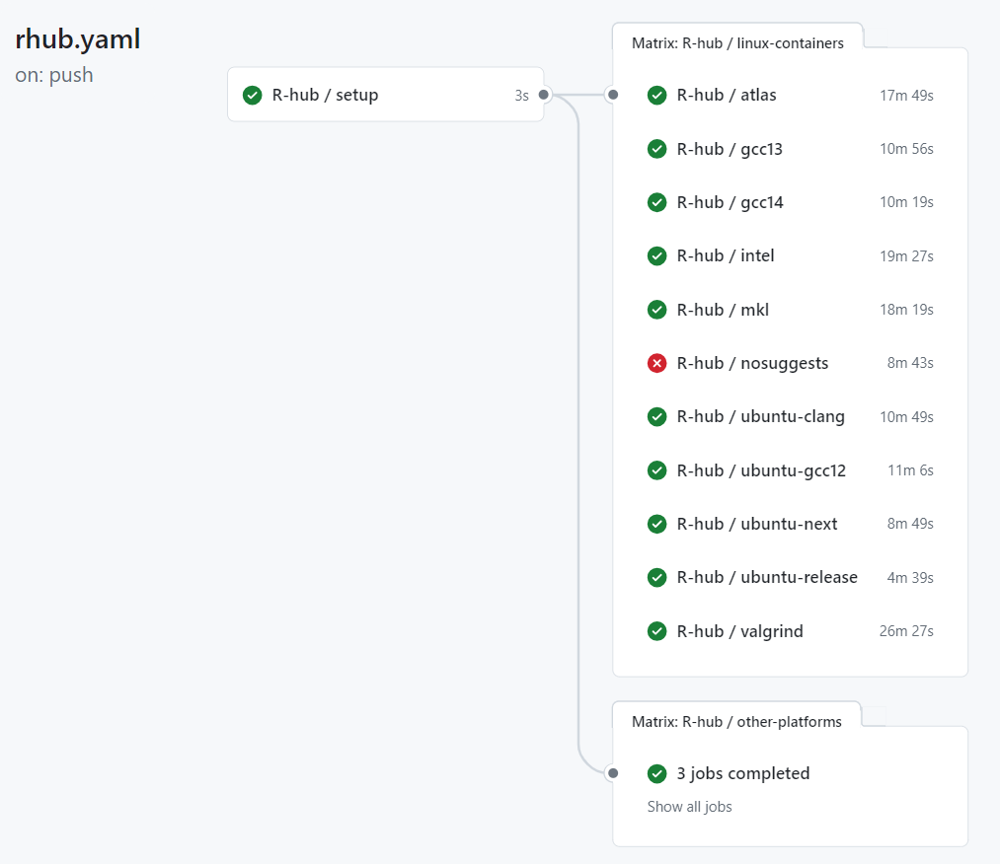

# What these workflows do?

## [`audit.yaml`](./.github/workflows/audit.yaml)

This workflow scans dependencies of your package for vulnerabilities using
[oysteR](https://cran.r-project.org/web/packages/oysteR/index.html).
Dependencies can be retrieved either from `DESCRIPTION` file or from `renv.lock` file.


## [`bioccheck.yaml`](./.github/workflows/bioccheck.yaml)

This workflow implements Bioconductor-specific R package checks with
[BiocCheck](https://bioconductor.org/packages/release/bioc/html/BiocCheck.html).


## [`branch-cleanup.yaml`](./.github/workflows/branch-cleanup.yaml)

This workflow checks if any (non-default) branches had the last commit added to them
more than a configurable number of days ago. If yes, such branches are deleted.


## [`build-check-install.yaml`](./.github/workflows/build-check-install.yaml)

This workflow includes the following activities:

1. Build an R package.
2. Run `R CMD check`.
3. Publish unit test summary.
4. Catch any notes, warnings etc. in the `R CMD check` output.
5. Install the package.


## [`gitleaks.yaml`](./.github/workflows/gitleaks.yaml)

This workflow runs [`gitleaks`](https://github.com/zricethezav/gitleaks) on the repo to discover
any secrets that might have been hardcoded.


Additionally, it runs [`presidio-cli`](https://github.com/insightsengineering/presidio-cli) to find
any personally identifiable information (PII) within the `git` repo.


## [`grammar.yaml`](./.github/workflows/grammar.yaml)

This workflow uses [`write-good`](https://github.com/btford/write-good) to check changed files
with names matching a pattern for English sentences that could be corrected.
Then, it adds annotations to the pull request so that problematic grammar can be reviewed.


## [`licenses.yaml`](./.github/workflows/licenses.yaml)

This workflow generates a license report of R package's dependencies for
continuous compliance.


## [`links.yaml`](./.github/workflows/links.yaml)

This workflow checks whether URLs embedded in code and documentation are valid. This workflow uses
[`lychee`](https://github.com/lycheeverse/lychee) to detect broken links. Occasionally, this check
will detect false positives of strings that look like URLs. To remedy, please add this false
positive to the `.lycheeignore` file.


## [`linter.yaml`](./.github/workflows/linter.yaml)

This workflow lints the codebase using [`super-linter`](https://github.com/github/super-linter).


## [`pkgdown.yaml`](./.github/workflows/pkgdown.yaml)

Documentation for the R package is generated via this workflow. This workflow uses the
[`pkgdown`](https://pkgdown.r-lib.org/) framework to generate documentation in HTML,
and the HTML pages are then deployed to the `gh-pages` branch.

Moreover, an additional `Versions` dropdown is generated via the GitHub Action, so that
the end user can view multiple versions of the documentation for the package.


## [`release.yaml`](./.github/workflows/release.yaml)

This workflow creates a GitHub release from a `git` tag and generates changelog based
on `NEWS.md` file.


## [`roxygen.yaml`](./.github/workflows/roxygen.yaml)

This workflow uses [`roxygen`](https://roxygen2.r-lib.org/) to generate `.Rd` files in
`man/` directory. It also checks if manuals are up-to-date with roxygen comments in the code.


## [`spelling.yaml`](./.github/workflows/spelling.yaml)

Spellchecks are performed by this workflow, and the
[`spelling`](https://docs.ropensci.org/spelling/) R package is used to detect spelling mistakes.
In the `inst/WORDLIST` file, you can add words and/or acronyms that you want the
spell check to ignore.


## [`style.yaml`](./.github/workflows/style.yaml)

Code style is enforced via the [`styler`](https://styler.r-lib.org/) R package. The workflow
can be configured to commit files that had styling problems automatically, after
remediating the problems.


## [`test-coverage.yaml`](./.github/workflows/test-coverage.yaml)

This workflow examines the test coverage of given R package with [`covr`](https://covr.r-lib.org/).
Following that, coverage report is added to the PR. Additional feature is the ability
to compare code coverage between branches, so the PR can be declined if the coverage
would decrease following the merge.

The second part of the workflow runs utilizes `covtracer` to:

* prepare traceability matrix
* identify untested behavior
* verify directly tested functions

## [`validation.yaml`](./.github/workflows/validation.yaml)

This workflow generates and publishes validation report.


## [`version-bump.yaml`](./.github/workflows/version-bump.yaml)

This workflow increases R package version in `NEWS.md` and `DESCRIPTION` files and
commits this change to the repository.


## [`version.yaml`](./.github/workflows/version.yaml)

This workflow checks if `NEWS.md` and `DESCRPTION` files have the same R package version.


## Adding unit test and coverage reports to `pkgdown` documentation

In order to add unit test reports and coverage reports to the documentation generated by `pkgdown`,
the following steps are needed.

1. If you'd like to have a custom branding in unit test report, add `unit-test-report-brand` parameter
    to the `build-check-install.yaml` workflow. See examples below.
1. Don't use the `skip-r-cmd-install` parameter so that unit test report gets generated.
1. `build-check-install.yaml` and `test-coverage.yaml` should depend on `pkgdown.yaml` workflow.
    This is to ensure that race condition where `pkgdown.yaml` workflow overwrites `gh-pages` branch is avoided.
    This can be done for example by:
    * setting the `needs: [docs]` for `build-check-install.yaml` and `test-coverage.yaml` workflows,
    * or if the `build-check-install.yaml` and `test-coverage.yaml` are invoked from another workflow
    than `pkgdown.yaml`, additional dependency can be added which will trigger `test-coverage.yaml`
    and `build-check-install.yaml` after `pkgdown.yaml` has finished running. See example below.
1. `_pkgdown.yaml` should be updated with the following contents to ensure that
    links to coverage report and unit test report appear in the navbar.

    ```yaml
    navbar:
      structure:
        left: [intro, reference, articles, tutorials, news, reports]
        right: [search, github]
      components:
        reports:
          text: Reports
          menu:
          - text: Coverage report
            href: coverage-report/
          - text: Unit test report
            href: unit-test-report/
        github:
          icon: fa-github
          href: <url-to-the-repository>
    ```

Example configuration for `main` branch:

```yaml
name: Check 🛠
on:
  push:
    branches:
      - main
  workflow_run:
    workflows: ["Docs 📚"]
    types:
      - completed
jobs:
  r-cmd:
    name: R CMD Check 🧬
    uses: insightsengineering/r.pkg.template/.github/workflows/build-check-install.yaml@main
    with:
      unit-test-report-brand: >-
        https://github.com/insightsengineering/hex-stickers/raw/main/thumbs/tern.png
  coverage:
    name: Coverage 📔
    uses: insightsengineering/r.pkg.template/.github/workflows/test-coverage.yaml@main
```

Example configuration for tags:

```yaml
name: Release 🎈
on:
  push:
    tags:
      - "v*"
jobs:
  build:
    name: Build package 🎁
    needs: [release, docs]
    uses: insightsengineering/r.pkg.template/.github/workflows/build-check-install.yaml@main
    with:
      unit-test-report-brand: >-
        https://github.com/insightsengineering/hex-stickers/raw/main/thumbs/tern.png
  coverage:
    name: Coverage 📔
    needs: [release, docs]
    uses: insightsengineering/r.pkg.template/.github/workflows/test-coverage.yaml@main
  docs:
    name: Pkgdown Docs 📚
    needs: release
    uses: insightsengineering/r.pkg.template/.github/workflows/pkgdown.yaml@main
```

## [`rhub.yaml`](./.github/workflows/rhub.yaml)

This is a workflow based on the [official R-hub workflow](https://github.com/r-hub/actions/blob/main/workflows/rhub.yaml) with the main goal being to `R CMD check` the package on different environments corresponding to the CRAN checks.


