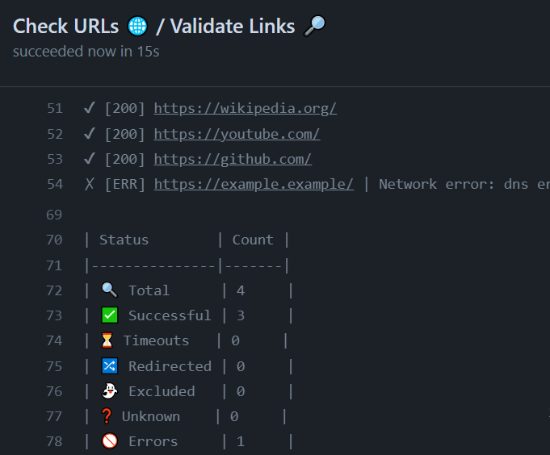

# What these workflows do?

## [`audit.yaml`](./.github/workflows/audit.yaml)

This workflow scans dependencies of your package for vulnerabilities using [oysteR](https://cran.r-project.org/web/packages/oysteR/index.html).
Dependencies can be retrieved either from `DESCRIPTION` file or from `renv.lock` file.

## [`bioccheck.yaml`](./.github/workflows/bioccheck.yaml)

This workflow implements Bioconductor-specific R package checks with [BiocCheck](https://bioconductor.org/packages/release/bioc/html/BiocCheck.html).

## [`build-check-install.yaml`](./.github/workflows/build-check-install.yaml)

This workflow:
* builds R package,
* runs `R CMD check`,
* publishes unit test summary,
* catches any notes, warnings etc. in the `R CMD check` output,
* installs the package.

## [`gitleaks.yaml`](./.github/workflows/gitleaks.yaml)

This workflow runs [`gitleaks`](https://github.com/zricethezav/gitleaks) on the repo to discover any secrets that might have
been committed.

Additionally, it runs [`presidio-cli`](https://github.com/insightsengineering/presidio-cli) to find any personally identifiable information
within the `git` repo.

## [`grammar.yaml`](./.github/workflows/grammar.yaml)

This workflow uses [`write-good`](https://github.com/btford/write-good) to check changed files
with names matching a pattern for English sentences that could be corrected.
Then, it adds annotations to the pull request so that problematic grammar can be reviewed.

## [`licenses.yaml`](./.github/workflows/licenses.yaml)

This workflow generates a license report of R package's dependencies for
continuous compliance.

## [`links.yaml`](./.github/workflows/links.yaml)

This workflow checks whether URLs embedded in code and documentation are valid. This workflow uses [`lychee`](https://github.com/lycheeverse/lychee) to detect broken links. Occasionally this check will detect false positives of strings that look like URLs. To remedy, please add this false positive to the `.lycheeignore` file.

## [`linter.yaml`](./.github/workflows/linter.yaml)

This workflow lints the codebase using [`super-linter`](https://github.com/github/super-linter).

## [`pkgdown.yaml`](./.github/workflows/pkgdown.yaml)

Documentation for the R package is generated via this workflow. This workflow uses the [`pkgdown`](https://pkgdown.r-lib.org/) framework to generate documentation in HTML, and the HTML pages are deployed to the `gh-pages` branch.

Moreover, an additional `Versions` dropdown is generated via the GitHub Action, so that the end user can view multiple versions of the documentation for the package.

